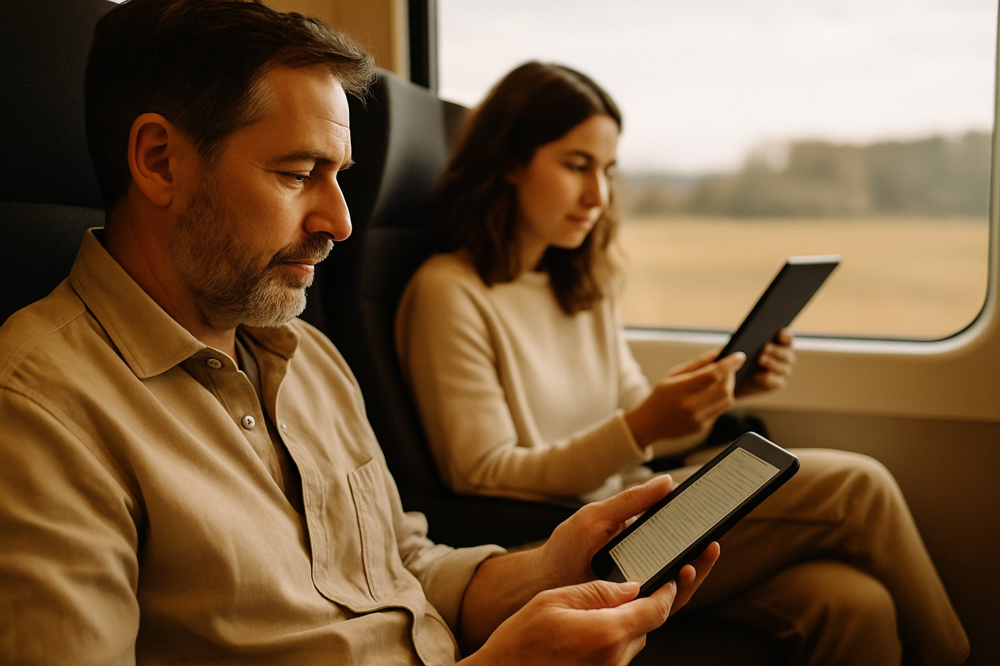

Jeszcze nie tak dawno książka kojarzyła się z czymś, co zajmuje półki, pachnie farbą drukarską i szeleszczy przy przewracaniu stron. Dziś książki towarzyszą nam na zupełnie innych nośnikach – na ekranie telefonu, na lekkim czytniku w plecaku, na tablecie rzuconym na łóżko, a nawet między Excela a przeglądarkę w pracy.

Na podstawie własnych doświadczeń i rozmów z innymi widzę, że – cyfrowe czytanie stało się częścią codzienności. Każdy ma swój rytuał. Dla jednych to kilka stron przed snem na Kindle’u. Dla innych – fragment rozdziału przy porannej kawie w aplikacji na smartfonie. A dla wielu – e-book na drugim monitorze, gdzieś obok arkusza kalkulacyjnego.

Jakie urządzenia najczęściej wybieramy do czytania w Polsce? I dlaczego czytanie cyfrowe to już nie tylko „zastępnik” papieru, ale pełnoprawny styl życia?

---

## Czytnik e-booków – poranna kawa i popołudnie na tarasie

Wyciągasz go z plecaka, włączasz, a on wita cię ostatnią przeczytaną stroną. **Czytniki e-booków** (takie jak Kindle, PocketBook czy InkBook) to niekwestionowani mistrzowie relaksu. Dzięki ekranowi E-Ink nie męczą oczu i sprawiają, że nawet w słońcu możesz czytać bez przeszkód. To urządzenie często ma swoje stałe miejsce: na szafce nocnej, w torbie na wakacje, w kieszeni kurtki do pociągu.

**Popularne marki w Polsce:**
- Kindle (nadal bardzo popularny, mimo braku oficjalnego wsparcia Amazon w języku polskim),
- PocketBook (z Legimi, Empik Go, ReadEra),
- InkBook (polski producent z pełnym wsparciem języka i aplikacji).

---

## Smartfon – książka zawsze pod ręką

Telefon jest jak szwajcarski scyzoryk – mamy go przy sobie **zawsze**. A skoro zawsze jest z nami, to czemu nie miałby też służyć do czytania? W drodze do pracy, w kolejce w sklepie, na ławce w parku – **czytanie na smartfonie to nie wyjątek, tylko codzienność**.

**Popularne aplikacje mobilne:**
- **Legimi**, **Empik Go** – najpopularniejsze w Polsce, oferujące również abonamenty,
- **Kindle** (Amazon),
- **ReadEra**, **PocketBook Reader** – bezpłatne, obsługujące pliki EPUB, PDF i MOBI.

---

## Tablet i iPad – ekran większy niż życie

Dla tych, którzy chcą czegoś więcej – większego, kolorowego, wygodnego – **tablet lub iPad** to strzał w dziesiątkę. Idealny do czytania **komiksów, czasopism, albumów** i wszystkiego, co wymaga przestrzeni. Często służy jako **domowe centrum rozrywki i czytania w jednym**.

**Czytanie z tabletem** ma swój klimat – leżysz na kanapie, książka na ekranie, kawa w zasięgu ręki.

**Najpopularniejsze urządzenia:**
- iPad, iPad mini (z aplikacją Apple Books),
- Samsung Galaxy Tab,
- Lenovo Tab,
- PocketBook InkPad Color (z kolorowym ekranem E-Ink – dla komiksiarzy).

**Dlaczego wybieramy tablety:**
- lepsza obsługa PDF i dokumentów z grafiką,
- większy komfort przy dłuższej lekturze w domu,
- idealne dla dzieci i młodzieży (np. w edukacji).

---

## Komputer – między pracą a książką

Nie wszyscy mają czas, żeby usiąść z książką na kanapie. Dla wielu osób **czytanie dzieje się przy okazji pracy** – gdzieś między wysłaniem maila a sprawdzaniem danych. I tu właśnie wchodzą do gry komputery – laptopy i desktopy.

Czytanie przy biurku? Czemu nie! Szczególnie jeśli chodzi o **publikacje naukowe, dokumenty PDF, skrypty, raporty**, albo nawet... e-booki z Legimi.

**Typowe aplikacje desktopowe w Polsce:**
- **Calibre** – darmowy czytnik i menedżer e-booków (EPUB, MOBI, PDF),
- **Adobe Acrobat Reader** – klasyka do PDF-ów,
- **FBReader**, **Sumatra PDF** – lekkie, szybkie, bez bajerów.

**Wtyczki do przeglądarek:**
- **EpubPress (dla Chrome i Firefox)** – zapisuje artykuły z internetu jako e-booki (EPUB lub MOBI),
- **Mercury Reader** – przekształca strony internetowe w czytelną wersję „jak książka”.

**Ciekawostka:** W 2024 roku ponad 25% e-booków kupionych przez osoby 35+ w Polsce zostało otwartych najpierw na... komputerze.

---

## Czytnik, smartfon czy laptop? To zależy od dnia

| Urządzenie        | Gdzie najczęściej?         | Idealne do                        |
|------------------|----------------------------|----------------------------------|
| Czytnik e-booków | W domu, na wakacjach       | Powieści, długie książki         |
| Smartfon         | W tramwaju, kolejce, łóżku | Fragmenty, artykuły, e-booki     |
| Tablet / iPad    | Kanapa, samolot, łóżko     | PDF-y, komiksy, poradniki        |
| Komputer         | Biurko, uczelnia, praca    | Nauka, dokumenty, publikacje PDF |

---

## Wnioski? Czytamy wszędzie!

Każde urządzenie spełnia inną funkcję – jedno jest idealne na wakacje, inne w tramwaju, jeszcze inne między plikami Excela. Najważniejsze? **Czytamy coraz więcej i coraz częściej.** Niezależnie od tego, czy wybierasz Kindle’a czy telefon – robisz coś dobrego dla siebie.