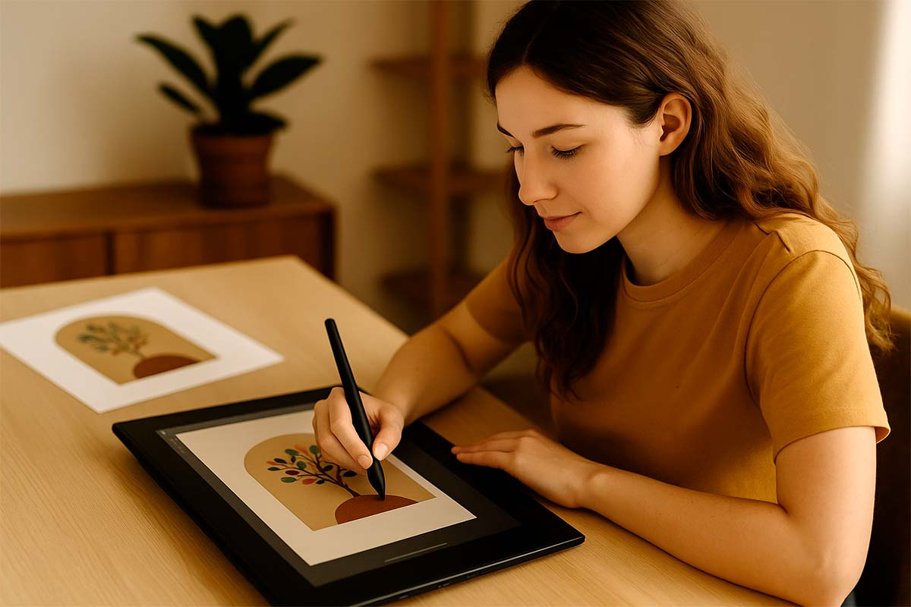

Jeśli jesteś ilustratorem i przygotowujesz prace do książki albo publikacji, pewnie wiesz, że największe zaskoczenia pojawiają się przy… kolorach. To, co na ekranie wygląda świetnie, na papierze potrafi wyjść zgaszone, za ciemne albo po prostu inne.  

Żeby tego uniknąć, warto od początku ustawić właściwe **profile kolorystyczne** i wiedzieć, w jakim trybie pracować. To naprawdę robi różnicę.  

---

## Profile kolorów – od tego zacznij

Każda drukarnia pracuje w określonym profilu CMYK. Najczęściej spotkasz:  

- **Coated FOGRA39 (ISO 12647-2:2004)** – klasyk dla papierów powlekanych (kreda, albumy, książki ze zdjęciami),
- **PSO Coated v3 (FOGRA51)** – nowszy standard dla powlekanych,  
- **PSO Uncoated v3 (FOGRA52)** – papier niepowlekany (Munken, offset, książki dziecięce).  

Jeśli nie masz pewności – zawsze warto zapytać projektanta składu albo samą drukarnię.  

---

## Dwa scenariusze pracy

I tu dochodzimy do najważniejszego: **czy pracować w RGB, czy w CMYK?** Odpowiedź brzmi: *to zależy*.  

### Scenariusz 1 – ilustracje malarskie, cyfrowe, zdjęcia
Jeśli Twoje ilustracje są bogate w przejścia tonalne, wyglądają trochę jak obrazy albo zdjęcia → najlepiej pracować w **RGB**.  

Dlaczego?  
- RGB ma większą przestrzeń barw niż CMYK,  
- kolory są bardziej nasycone,  
- przejścia tonalne wychodzą gładko.  

Na końcu, już w Photoshopie albo podczas eksportu do PDF z InDesigna, konwertujesz całość do CMYK zgodnie z profilem drukarni. Dzięki temu masz kontrolę, jak kolory wyglądają po „przejściu” do druku.  

---

### Scenariusz 2 – ilustracje płaskie, wektorowe, dziecięce
Jeśli tworzysz ilustracje, które opierają się na **konkretnych próbkach kolorów** (np. 0C 25M 90Y 0K dla żółtego), lepiej od razu pracować w **CMYK**.  

Wtedy:  
- wartości liczbowe zostają zachowane,  
- nie ma niespodzianek przy konwersji z RGB,  
- wszystkie kolory w książce będą spójne.  

Najlepiej od początku ustawić profil drukarni (np. FOGRA39 albo FOGRA52, jeśli druk ma być na Munkenie).  

---

## Jak zapisywać pliki?

- **Format roboczy:**  
  – ilustracje wektorowe: **.AI (Adobe Illustrator)**,  
  – ilustracje rastrowe: **.PSD (Photoshop)**.  

- **Format do składu:**  
  – rastrowe: **.TIFF (CMYK, 300 dpi)**,  
  – wektorowe: **.EPS** albo **.PDF**.  

Unikaj JPG w finalnych plikach – kompresja niszczy jakość i zostawia artefakty.  

---

## Uważaj na wartości kolorów

To jest pułapka: **te same liczby CMYK mogą wyglądać inaczej w różnych profilach**.  

Przykład: kolor `0C 100M 100Y 0K` na kredzie (FOGRA39) będzie intensywnie czerwony, a na Munkenie (FOGRA52) wyjdzie bardziej ceglasty.  

Dlatego tak ważne jest, żeby profil dokumentu = profil drukarni.  

---

## Checklista przed oddaniem plików

1. Tryb: **RGB** (dla malarskich) albo **CMYK** (dla płaskich).  
2. Profil: zgodny z drukarnią (np. FOGRA39, FOGRA51, FOGRA52).  
3. Rozdzielczość: **300 dpi** dla plików rastrowych.  
4. Format: TIFF/EPS/PDF – bez stratnej kompresji.  
5. Nazwy plików: jasne i jednoznaczne, np. `Ilustracja_01_FOGRA39.tiff`.  

---

## Dostarczenie plików

- Wyślij pliki w jednym folderze, uporządkowane i nazwane.  
- Jeśli masz wątpliwości, wyślij **1 ilustrację testową** przed przygotowaniem całej serii. To oszczędzi Ci sporo stresu.  

---

## Podsumowanie

- **Ilustracje malarskie, cyfrowe, zdjęcia** → pracuj w **RGB**, a konwersję do CMYK zostaw na koniec.  
- **Ilustracje płaskie, dziecięce, wektorowe** → pracuj od razu w **CMYK** i w profilu drukarni.  
- Zawsze trzymaj się profilu, który poda drukarnia – to on decyduje, jak liczby CMYK zamienią się w rzeczywiste kolory na papierze.  

Dzięki temu Twoje ilustracje będą wyglądały w druku tak, jak planowałaś – a klient nie będzie zaskoczony, że „żółty nie jest taki żółty”.  

---

## Zobacz też

[Dowiedz się więcej o profilach kolorystycznych](/profile-kolorystyczne-rgb-cmyk)

