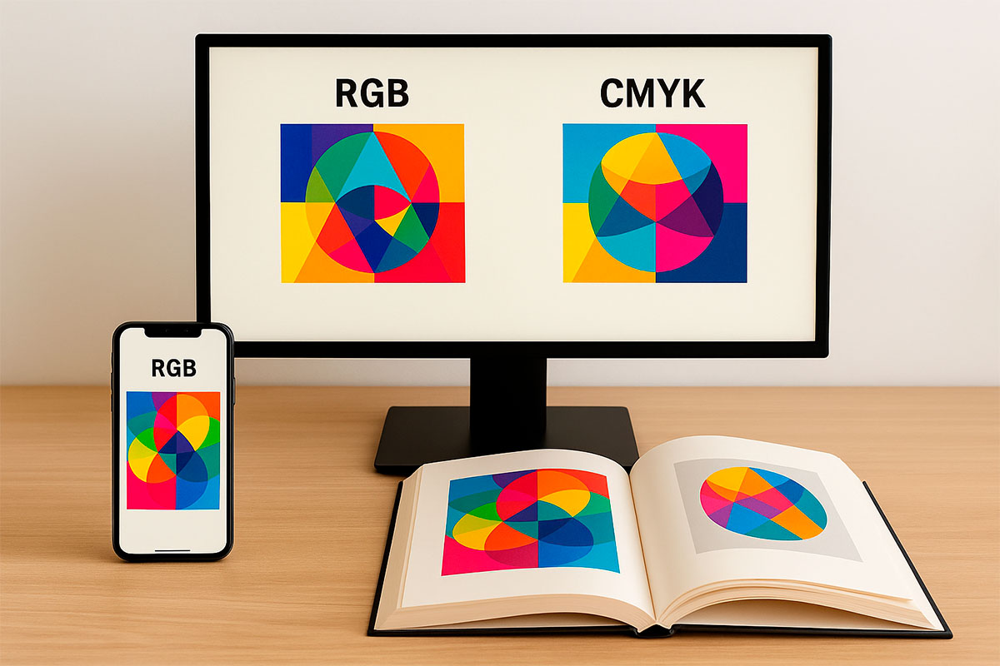
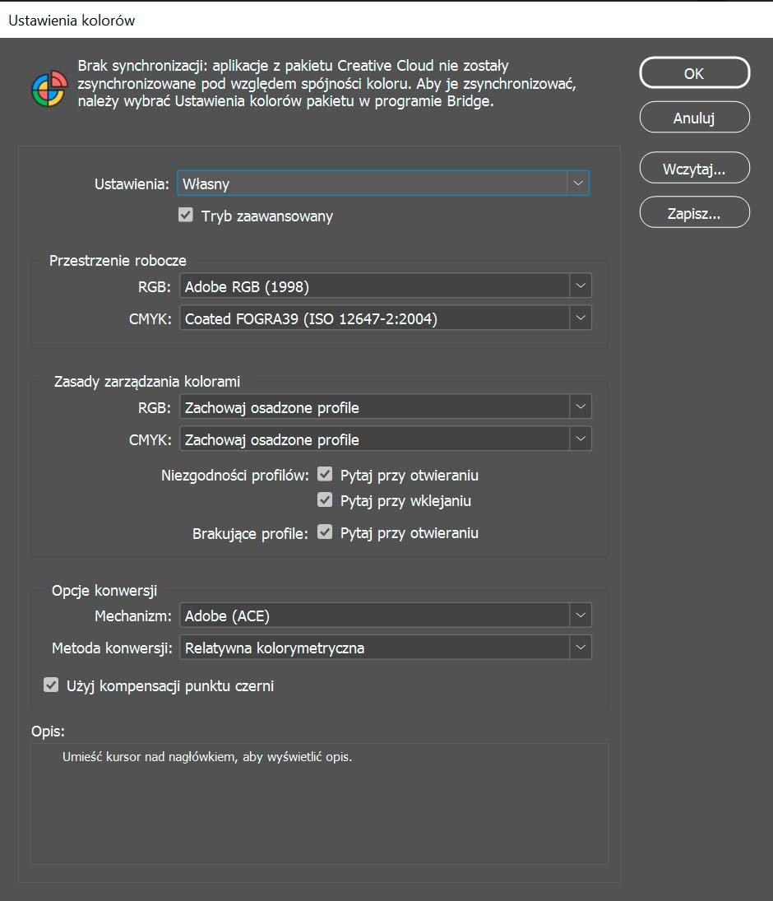
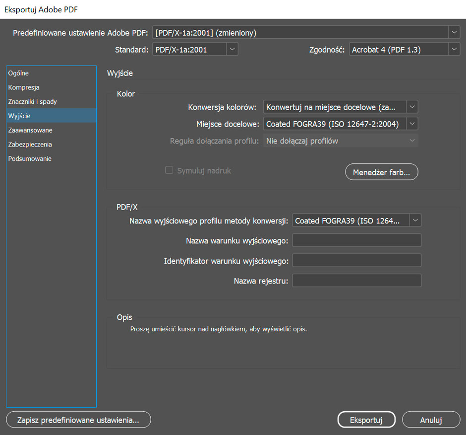

# Profile kolorystyczne – przewodnik dla początkujących

Kolory potrafią płatać figle. To, co na ekranie wygląda soczyście i jaskrawo, w druku nagle robi się przygaszone albo przesunięte w stronę zieleni. Dlaczego tak się dzieje? Odpowiedź brzmi: **profile kolorystyczne**.  

W tym wpisie wyjaśnię, co to w ogóle jest, po co się tym zajmować i jak z nimi pracować w codziennej praktyce – od zdjęcia w Photoshopie, przez skład w InDesignie, aż po gotowy plik PDF dla drukarni.  

---

## Co to są profile kolorystyczne?

Najprościej mówiąc: profil kolorystyczny to **słownik, który mówi komputerowi, jak rozumieć kolory**.  

Każde urządzenie ma swoje spojrzenie na świat:  
- aparat zapisuje zdjęcie w przestrzeni **RGB**,  
- skaner ma własny profil,  
- monitor wyświetla kolory według swojego profilu,  
- drukarka i maszyna drukarska pracują w przestrzeni **CMYK**.  

Bez profili każdy widziałby „czerwony” po swojemu. Dzięki nim można przełożyć kolor z jednego urządzenia na drugie i zachować spójność.  

---

### Co opisuje profil kolorystyczny?

Profil ICC (International Color Consortium) to taki **„matematyczny opis”**, jak system kolorów zachowuje się na danym urządzeniu.  
Dla profili drukarskich (CMYK) bierze pod uwagę m.in.:  

- **Rodzaj papieru**  
  – powlekany, niepowlekany, gazetowy, recyklingowy, kreda, Munken itp.  
  – to wpływa na chłonność, kontrast, nasycenie barw.  

- **Rodzaj farby i jej gęstość**  
  – standardowe farby offsetowe, farby szybkoschnące, ekologiczne, farby dla druku cyfrowego.  
  – różne farby inaczej oddają intensywność i głębię kolorów.  

- **Maszyna drukarska i warunki druku**  
  – offset arkuszowy, offset zwojowy, cyfrowa maszyna HP Indigo, druk laserowy…  
  – każda technologia ma inne ograniczenia kolorystyczne (gamut).  

- **Maksymalne pokrycie farbą (TAC – Total Area Coverage)**  
  – np. w FOGRA39 TAC = 300% → to znaczy, że suma C+M+Y+K nie może przekraczać 300, bo papier by się nie wysuszył.  
  – w niektórych profilach (np. gazetowych) TAC jest niższe, np. 240%.  

- **Biel podłoża**  
  – kreda jest bielsza, Munken bardziej kremowy, gazeta szara – to też ma ogromny wpływ na odbiór kolorów.  
  – profil uwzględnia kolor papieru jako „tło” symulacji.  

---

### Co to oznacza w praktyce?

Profil nie symuluje tylko papieru – on opisuje **cały system druku**:  
papier + farby + technologia + ograniczenia + kolor podłoża.  

Dzięki temu w Photoshopie czy InDesignie możesz:  
- zobaczyć **soft proof** (podgląd symulowany wydruk),  
- upewnić się, czy kolory, które zaprojektowałaś, są w gamucie druku,  
- wiedzieć, jak zmieni się wygląd tego samego projektu na różnych papierach.  

---

### Podsumowanie

Profil kolorystyczny to nie tylko „papier powlekany vs niepowlekany”, ale **cały opis warunków druku**.  
Dlatego tak ważne jest, żeby zawsze używać tego profilu, który poda drukarnia – bo tylko on odpowiada realnym parametrom ich maszyn.    

---

## RGB a CMYK – dwa światy

- **RGB** (Red, Green, Blue) – kolory światła, czyli to, co widzisz na monitorze, telefonie, aparacie.  
- **CMYK** (Cyan, Magenta, Yellow, Black) – kolory farby, czyli to, co ląduje na papierze.  

- Zdjęcia startują w RGB.  
- Do druku kończą w CMYK.  

Zadanie profili polega na tym, by dobrze przeprowadzić obraz z jednego świata do drugiego.  

---

## Photoshop – zacznij od zachowania profilu

Zdjęcie z aparatu czy skanera ma **osadzony profil** (np. sRGB albo AdobeRGB).  
W Photoshopie najczęściej warto:  

- **zachować profil osadzony** → program pokaże kolory tak, jak zostały zapisane w pliku,  
- ustawić **profil roboczy** (czyli własną przestrzeń pracy), który pozwala zasymulować, jak obraz będzie wyglądał np. w druku.  

*Rys. 1. Ustawienia kolorów w Photoshopie – zachowujemy profile osadzone.*  

---

## InDesign – skład w spójnej przestrzeni

InDesign również korzysta z profili. Dobrze ustawić **profil roboczy dokumentu** (np. Europe Prepress 3). Dzięki temu program może **symulować wygląd wydruku**, czyli podgląd, jak kolory z RGB czy CMYK będą się zachowywać na papierze.  

Przy imporcie zdjęć najlepiej:  
- pozwolić im **zachować własne profile**,  
- nie konwertować od razu,  
- trzymać spójność całego projektu aż do momentu eksportu.  

*Rys. 2. Ustawienia kolorów w InDesignie – zachowaj osadzone profile.*  

---

## Eksport do PDF – moment decyzji

I dopiero na końcu, przy eksporcie do PDF, wybierasz profil drukarni.  
Najczęściej spotykane:  

- **FOGRA39** – druk offsetowy na papierze powlekanym,  
- **FOGRA52** – druk na papierze niepowlekanym.  

W oknie eksportu:  
Plik → Eksportuj → Adobe PDF (druk) → zakładka **Wyjście (Output)** → wybierasz właściwy profil jako **Output Intent**.  

*Rys. 3. Eksport PDF w InDesignie – wybór profilu FOGRA39 jako Output Intent.*  

---

## Jedna z możliwych dróg

W praktyce są różne podejścia do zarządzania kolorami. Ja często rekomenduję ścieżkę: **zachowaj profile na etapie pracy w Photoshopie i InDesignie, a konwertuj dopiero przy eksporcie do PDF**.  

Dlaczego? Bo to najprostsza i najbezpieczniejsza metoda, jeśli nie masz specjalnych powodów, żeby zmieniać profile wcześniej.  
Ale jeśli Twoja drukarnia wymaga konkretnej przestrzeni już na etapie przygotowania grafik, albo masz powód, by kontrolować konwersję kolorów od początku – możesz oczywiście zmienić profil wcześniej.  

---

## Po co to wszystko?

Ktoś mógłby zapytać: a czy nie wystarczy „zapisać plik i wysłać do druku”?  
Niestety nie. Bez profili:  

- monitor pokazuje jedno, a drukarnia drukuje coś zupełnie innego,  
- kolory tracą spójność między zdjęciami,  
- trudno przewidzieć efekt końcowy.  

Profile kolorystyczne to **narzędzie kontroli** – dzięki nim wiesz, że to, co widzisz na ekranie, będzie miało sens na papierze.  

---

## Podsumowanie – flow pracy z profilami

1. **Photoshop** – pracuj na zdjęciach z ich osadzonym profilem. Profil roboczy pozwala Ci podglądać symulację druku, ale nie musisz konwertować od razu.  
2. **InDesign** – składaj publikację, zachowując osadzone profile obrazów. Profil roboczy dokumentu daje Ci pogląd, jak kolory będą wyglądać w druku.  
3. **Eksport do PDF** – tu wybierasz profil drukarni (Output Intent). To on gwarantuje, że kolory będą dopasowane do papieru i maszyny.  

To jedna z dróg, którą polecam, jeśli nie ma powodu, by zmieniać profile wcześniej. Dzięki niej nie pogubisz kolorów i zachowasz kontrolę aż do samego końca.  

---

## 3 błędy, których łatwo uniknąć

- **Brak profilu w pliku** – zdjęcie bez osadzonego profilu może wyglądać inaczej w każdym programie. Zawsze upewnij się, że plik ma przypisany profil.  

- **Wielokrotne konwersje** – jeśli raz zmienisz przestrzeń (np. RGB → CMYK), a potem jeszcze raz (np. CMYK → inny CMYK), każda konwersja „zjada” trochę jakości koloru. Lepiej zrobić to tylko raz, na końcu.  

- **Ignorowanie profilu drukarni** – nawet najlepiej przygotowany PDF bez odpowiedniego profilu końcowego może dać niespodzianki w druku. Zawsze zapytaj drukarnię o profil, którego używają.  

---

Dzięki tym prostym zasadom będziesz mieć spokojną głowę – kolory nie zaskoczą ani Ciebie, ani drukarza.  

Jesteś ilustratorem i chcesz wiedzieć, jak przygotować swoje prace do druku?  
[Przeczytaj przewodnik dla ilustratorów](/jak-przygotowac-ilustracje-do-druku)

