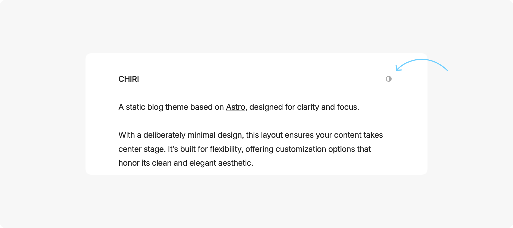

不是医学或者心理学专业，谈一下自己的理解。强迫症的原因，我认为是情绪埋雷过久。

人从年幼（或者说婴儿时期）起，快速开始构建自我的意识和认知，速度逐渐减慢，一直到成年后的某个时刻，这个构建基本完成。

我们可以将这个过程视为填格子。假定一个人的情绪格子有10000个，那么一起初，快速填充格子时候，会把或好或坏的经历以及相应的情绪反应放在一个个格子里。而且这些情绪反应不会因为被拿去填充完毕而消散，只是“活埋”在一个个格子里。

如果饿了大哭，母亲没有喂奶，一个格子里就填上了需求未被满足的失落；如果要抱抱，父母没有及时应答，也会在一个格子里填上消极的反应。类似地，积极的、中平的等等都会这样去爬满那10000个格子。

到了成年格子基本填满后，有些人80%以上的格子填满了美好和积极的反应，有些人50%的格子填满了失落和悲伤。大家于是带着这个“情绪库”去面对生活、工作、学习中种种事件，然后在每个事件来临时调用对应格子的情绪反映。

那么一个人，如果童年幸福、少年轻松，应对将来种种事件时，调用到积极情绪反应的概率就高，体现出高情绪壁垒和耐受力，这就是“幸福的童年可以治愈一辈子”。

而有些人，临事时总容易触发出那些消极情绪，非常容易因为触发消极格子次数过多而最后造成生理上（躯体）的不适（心慌、心神不宁等等），调用出负面应答的可能性不仅高，而且会连环一起引爆，引爆范围大小决定了是否得神经官能症（强迫、抑郁等）、以及发病的轻重。然后需要长期一段时间去寻回快乐、积极的能力，所谓“不幸的人，用一辈子去治愈童年”。

强迫症患者，多数固执（先天）、纠结别人对自己的评价（过分自尊、后天）、纠结自己对他人的影响（后天）、不随和（后天）、又怂（先天后天参半）、等等，这些个性特质大多因为成年前原生家庭环境的影响（后天部分的塑造，主要）、遗传也有部分原因（先天部分的形成，次要）。早期出现余光强迫症、口水强迫症等早期症状时又被忽略，经年累月发展到影响生活的程度。

正常人对念头有一个直觉的滤网，一个人一天会产生极多偶发的念头，这张滤网帮我们过滤掉了直觉认为不需要跟进的杂念（自动档）；而强迫症患者，因为容易调用消极反应，在怂的心理下逐渐放弃了滤网（动辄害怕自己某个言行或者某个事件的不良后果），而改用人工筛选的方式（手动档），抓住各种杂念跟进思考，消耗掉神经递质的正常配额，最后越陷越深。

希望各位强友们先从不怂做起，大胆去接纳不完美和不良后果，把正常人的情绪能力习得回来。

## Basic Commands

- `pnpm new <title>` - Create a new post (use `_title` for drafts)
- `pnpm update-theme` - Update the theme to the latest version

## Main Files & Directories

- `src/content/about/about.md` - Edit the about section of the index page. Leave it empty if you don't want any content.
- `src/content/posts/` - All blog posts are stored here
- `src/config.ts` - Configure main site info and settings

```ts
// Site Info
site: {
  website: 'https://astro-chiri.netlify.app/', // Site domain
  title: 'CHIRI', // Site title
  author: '3ASH', // Author name
  description: 'Minimal blog built by Astro', // Site description
  language: 'en-US' // Default language
},
```

```ts
// General Settings
general: {
  contentWidth: '35rem', // Content area width
  centeredLayout: true, // Use centered layout (false for left-aligned)
  themeToggle: false, // Show theme toggle button (uses system theme by default)
  postListDottedDivider: false, // Show dotted divider in post list
  footer: true, // Show footer
  fadeAnimation: true // Enable fade animations
},
```

```ts
// Date Settings
date: {
  dateFormat: 'YYYY-MM-DD', // Date format: YYYY-MM-DD, MM-DD-YYYY, DD-MM-YYYY, MONTH DAY YYYY, DAY MONTH YYYY
  dateSeparator: '.', // Date separator: . - / (except for MONTH DAY YYYY and DAY MONTH YYYY)
  dateOnRight: true // Date position in post list (true for right, false for left)
},
```

```ts
// Post Settings
post: {
  readingTime: false, // Show reading time in posts
  toc: true, // Show table of contents (when there is enough page width)
  imageViewer: true, // Enable image viewer
  copyCode: true, // Enable copy button in code blocks
  linkCard: true // Enable link card
}
```

## Post Frontmatter

Only `title` and `pubDate` are required fields

```ts
---
title: 'Post Title'
pubDate: '2025-07-10'
---
```

## Syntax Highlighting

You can configure the theme via `shikiConfig` in `astro.config.ts`.

More details: [Syntax Highlighting | Astro Docs](https://docs.astro.build/en/guides/syntax-highlighting/)

```ts
import { defineConfig } from 'astro/config'

export default defineConfig({
  markdown: {
    shikiConfig: {
      light: 'github-light',
      dark: 'github-dark',
      wrap: false
    }
  }
})
```

---

## Preview of Some Features




