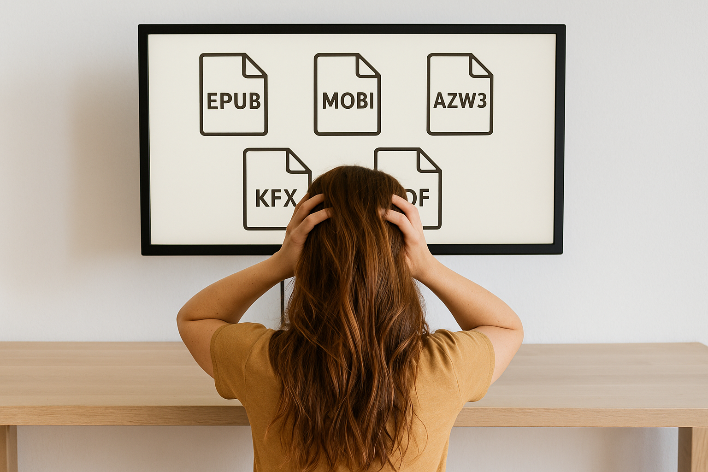

EPUB, MOBI, AZW3, KFX, PDF... Formatów e-booków wydaje się jest cała masa. Jeśli próbujesz zrozumieć, czym się różnią i który z nich wybrać dla swojej książki, możesz czuć się zagubiony. Każdy format ma swoje zalety i ograniczenia. Jedne są lepsze dla powieści, inne dla albumów. Jedne działają prawie wszędzie, inne tylko w ekosystemie Amazonu. Jak się w tym wszystkim połapać? Kiedy poznasz podstawowe różnice i zastosowania poszczególnych formatów — wybór stanie się prostszy, niż myślisz.

W tym artykule krok po kroku:

- wyjaśniam, czym naprawdę jest e-book (i dlaczego nie każdy PDF to e-book),  
- omawiam najważniejsze formaty e-booków i pokazuję, do czego się najlepiej nadają,  
- podpowiadam, który format wybrać w zależności od typu publikacji, platformy sprzedaży i potrzeb czytelników.

---

## Co to jest e-book? I dlaczego nie każdy plik cyfrowy nim jest?

Na pierwszy rzut oka może się wydawać, że każdy plik z tekstem — np. dokument Worda czy PDF — to już e-book. Ale to nie do końca prawda.

**E-book**, czyli elektroniczna książka, to publikacja:

- posiadająca strukturę książki (rozdziały, podrozdziały, nagłówki, przypisy, spis treści),  
- przystosowana do czytania na ekranach urządzeń mobilnych (czytnikach, smartfonach, tabletach, komputerach),  
- zoptymalizowana pod kątem różnych rozdzielczości i wielkości ekranów (*reflowable content*),  
- zapisana w odpowiednich formatach: EPUB, MOBI, AZW3, KFX lub PDF (choć ten ostatni ma ograniczenia).  

E-bookiem może być powieść, poradnik, reportaż, esej, przewodnik, a nawet zbiór blogowych postów — o ile został odpowiednio sformatowany z myślą o czytnikach.

Jednak nie każda publikacja cyfrowa jesto e-bookiem. Do tej kategorii należą prezentacje, raporty czy broszury reklamowe — często w formacie PDF. Choć mogą wyglądać podobnie, ich cel, struktura i sposób użycia są inne. Zazwyczaj nie są przystosowane do czytników, mają stały układ i służą raczej celom informacyjnym lub promocyjnym. Zrozumienie tej różnicy pozwala uniknąć błędnego przekonania, że *każdy PDF to e-book* — i pomaga lepiej dopasować format do rodzaju treści i potrzeb czytelnika.

---

## Czym jest format e-booka i od czego zależy jego wybór?

**Format e-booka** to techniczny sposób zapisania treści książki, który pozwala różnym urządzeniom poprawnie wyświetlać tekst, grafikę, układ stron i funkcje takie jak spis treści czy przypisy.

Aby dobrać odpowiedni format e-booka, warto wcześniej przyjrzeć się kilku istotnym aspektom technicznym i użytkowym, takim jak:

### Rodzaj publikacji

- Powieść z samym tekstem?  
- Poradnik z ilustracjami?  
- A może album fotograficzny lub katalog z układem graficznym?  

Niektóre formaty lepiej nadają się do treści tekstowych, inne do złożonych layoutów.

### Platforma dystrybucji

Wybór formatu zależy także od miejsca, w którym planujesz udostępnić e-booka. Różne platformy mają różne wymagania techniczne i standardy obsługiwanych plików.  
Większość polskich księgarni wspiera popularne, otwarte formaty, natomiast Amazon Kindle korzysta z własnych rozwiązań. Jeśli sprzedajesz e-booka samodzielnie — np. na własnej stronie internetowej — możesz sam zdecydować, jakie formaty zaoferujesz swoim czytelnikom.

### Urządzenia odbiorców

To, na jakim urządzeniu e-book będzie czytany, ma duży wpływ na wybór odpowiedniego formatu. Inne potrzeby mają użytkownicy klasycznych czytników e-booków (takich jak Kindle, PocketBook, Kobo), a inne osoby korzystające z telefonów, tabletów czy komputerów.  
Ważne są także takie czynniki jak: wielkość ekranu, sposób obsługi (np. dotykowy, fizyczne przyciski), czy używane aplikacje do czytania. Format, który świetnie działa na czytniku z e-papierem, może nie być wygodny do przeglądania na ekranie smartfona — i odwrotnie.

### Preferencje czytelników

Wybór formatu warto dopasować także do oczekiwań odbiorców. Niektórzy korzystają wyłącznie z czytników dedykowanych jednej platformie (np. Kindle), inni wolą mieć swobodę czytania na różnych urządzeniach — w aplikacjach mobilnych, na tabletach lub komputerach.  
Są też osoby, które preferują statyczny, „papierowy” układ stron — szczególnie w publikacjach o charakterze wizualnym, jak albumy czy katalogi. Format powinien więc odpowiadać zarówno technicznym możliwościom urządzeń, jak i nawykom czytelników.

---

## Przegląd najpopularniejszych formatów e-booków

### EPUB (.epub)

**Opis:**  
EPUB (skrót od Electronic Publication) to obecnie najpopularniejszy i najbardziej uniwersalny format e-booków na świecie. Został stworzony jako otwarty standard i jest rozwijany przez organizację [W3C](https://www.w3.org/), co zapewnia jego szeroką kompatybilność oraz elastyczność techniczną. Format EPUB pozwala na tworzenie tzw. treści *reflowable*, czyli takich, które automatycznie dopasowują się do rozmiaru ekranu i ustawień czytelnika — np. zmiany wielkości czcionki, marginesów czy interlinii. Dzięki temu książka w formacie EPUB może być wygodnie czytana na dowolnym urządzeniu. EPUB wspiera również rozbudowaną strukturę dokumentu, w tym spis treści, przypisy, hiperłącza, a także elementy graficzne i multimedia. Może być zabezpieczony technologią **DRM (Digital Rights Management)** – to ochrona przed nieautoryzowanym kopiowaniem i rozpowszechnianiem pliku. **Nie jest to jednak zalecany format do publikacji, które zawierają dużą liczbę infografik, tabel lub zdjęć**, ponieważ responsywna struktura może prowadzić do nieprzewidywalnego rozmieszczenia tych elementów na różnych urządzeniach i przy różnych ustawieniach czytelnika.

**Urządzenia:**  
- Czytniki: PocketBook, Kobo, InkBook – obsługują EPUB natywnie.  
- Aplikacje mobilne: Apple Books, ReadEra, Moon+ Reader, FBReader.  
- Komputery: Calibre, Adobe Digital Editions, Thorium Reader.

**Sprzedaż:**  
EPUB to standard większości księgarni internetowych (Publio, Empik Go, Apple Books, Google Play Books, Legimi). Amazon KDP również akceptuje EPUB jako plik wejściowy.

**Rekomendowany do:**  
- Powieści, opowiadań  
- Poradników, esejów  
- Książek edukacyjnych  
- Przewodników z ilustracjami

### Format Kindle: MOBI, AZW3, KFX

Amazon korzysta z własnych formatów przeznaczonych wyłącznie dla urządzeń i aplikacji Kindle.

**MOBI** – stary format, wycofany w 2022 r., nadal przydatny dla starszych czytników Kindle.  
**AZW3** – nowocześniejszy format z obsługą stylów, grafik i przypisów.  
**KFX** – najnowszy, oferuje zaawansowaną typografię i funkcje (Page Flip, X-Ray). Generowany automatycznie przez Amazon z pliku EPUB.

**Ważne!:**  
Autorzy nie muszą tworzyć tych formatów samodzielnie – wystarczy dobrze przygotowany EPUB zgodny z [wytycznymi Amazon](https://kdp.amazon.com/en_US/help/topic/G200634390), który platforma automatycznie konwertuje na odpowiedni format (np. KFX) na potrzeby dystrybucji i wyświetlania na urządzeniach Kindle.
  Dla **starszych Kindle** warto stworzyć **plik MOBI hybrydowy** (zawierający MOBI + AZW3), który przesyła się **przez kabel USB**.
  Formaty Kindle nie są zalecane do publikacji z dużą liczbą infografik, tabel, zdjęć lub złożonej szaty graficznej – responsywna struktura oraz automatyczna konwersja mogą powodować zniekształcenia lub nieprzewidywalne efekty.

**Rekomendowany do:**  
- Powieści  
- Opowiadań  
- Poradników  
- Esejów  
- Publicystyki  
- Biografii  
- Treści edukacyjnych z przewagą tekstu  
- Publikacji przygotowywanych z myślą o Amazon Kindle

### PDF (.pdf)

**Opis:**  
PDF to format o stałym, statycznym układzie stron – brak responsywności oznacza, że treść nie dopasowuje się do rozmiaru ekranu. Dzięki wysokiej wierności graficznej jest idealny do druku i publikacji, w których wygląd ma kluczowe znaczenie. Najlepiej sprawdza się na większych urządzeniach, takich jak tablety i komputery. PDF świetnie nadaje się do publikacji z dużą liczbą infografik, zdjęć, tabel i złożonego układu graficznego – takich jak raporty, katalogi, albumy czy książki kucharskie.

**Urządzenia:**  
Komputery, tablety, smartfony z aplikacją PDF. Czytniki z dużym ekranem (np. Onyx Boox).

**Sprzedaż:**  
Popularny jako dodatkowa wersja graficzna publikacji lub darmowy format do lead magnetów.

**Rekomendowany do:**  
- Albumów, katalogów  
- Książek kucharskich  
- Broszur, raportów  
- E-booków promocyjnych

### FB2 (FictionBook)

**Opis**:  
FB2 to prosty i lekki format e-booków, który był bardzo popularny w Rosji, na Ukrainie i częściowo w Polsce. Zamiast skupiać się na wyglądzie książki, FB2 koncentruje się na jej strukturze – na przykład: gdzie zaczyna się rozdział, co jest cytatem, a co przypisem. To trochę jak surowa wersja książki bez ozdobników.

**Urządzenia**:  
Pliki FB2 można czytać na wielu aplikacjach mobilnych (np. ReadEra, FBReader), a także na czytnikach e-booków takich jak PocketBook. Komputery też sobie z nim poradzą – np. przez program Calibre.

**Sprzedaż**:  
Dziś FB2 rzadko pojawia się w księgarniach – nie jest wspierany przez Amazon ani Apple. Ale nadal bywa używany w bibliotekach cyfrowych i przez czytelników z Europy Wschodniej. Tworzenie e-booka w tym formacie ma sens przede wszystkim wtedy, gdy **wiemy, że nasi czytelnicy faktycznie korzystają z FB2** — na przykład pochodzą z **Ukrainy**, gdzie ten format nadal jest popularny.

**Rekomendowany do**:  
- Powieści
- Opowiadań
- Poradników
- Esejów

### CBZ (Comic Book ZIP)

**Opis**:  
CBZ to format stworzony specjalnie do **komiksów i mangi**. Zamiast tekstu, zawiera po prostu obrazy kolejnych stron, spakowane razem w jednym pliku. Dzięki temu komiks można wygodnie przeglądać tak, jakby był papierowy — ale na ekranie.

**Urządzenia**:  
Działa świetnie w aplikacjach do komiksów, takich jak Perfect Viewer (Android), Chunky (iOS) czy CDisplayEx (Windows). Niektóre czytniki e-booków też obsługują CBZ, jeśli dobrze radzą sobie z grafiką.

**Sprzedaż**:  
CBZ nie jest używany na dużych platformach sprzedażowych typu Amazon, ale można go spotkać w niezależnych sklepach z komiksami lub w darmowych kolekcjach tworzonych przez fanów.

**Rekomendowany do**:  
- Komiksów, mangi, 
- ilustrowanych opowieści — wszędzie tam, gdzie tekst jest na drugim planie, a najważniejsze są obrazy.

### HTML

**Opis**:  
HTML to język, w którym zbudowane są strony internetowe — ale także e-booki! Choć sam plik HTML nie jest jeszcze książką, to właśnie z HTML-a tworzy się najpopularniejszy format e-booków: **EPUB**. Można więc potraktować go jako „składnik bazowy” e-booka.

**Urządzenia**:  
Każda przeglądarka internetowa (np. Chrome, Firefox) bez problemu otworzy plik HTML. Niektóre aplikacje do czytania e-booków (np. Calibre, FBReader) również potrafią go obsłużyć.

**Sprzedaż**:  
HTML nie jest akceptowany w księgarniach jako gotowy format książki, ale rzydaje się też do tworzenia książek dostępnych online, np. jako strony internetowe.

---

## Wskazówki dla autorów – jaki format wybrać?

| Sytuacja                                      | Rekomendowany format                       |
|----------------------------------------------|--------------------------------------------|
| Powieści, opowiadania, poradniki             | **EPUB** – uniwersalny i wygodny |
| Publikacja na Amazonie                       | **EPUB** *(zgodny z wytycznymi Amazon)* – Amazon sam konwertuje do formatów firmy Amazon |
| Raporty, katalogi, bogata grafika            | **PDF** – wierne odwzorowanie projektu |
| Książki kucharskie, albumy                   | **PDF + EPUB** – wersja graficzna i mobilna|
| Dotarcie do szerokiego grona czytelników     | **EPUB + PDF** – różne formaty, większy zasięg |
| Czytelnicy ze starszymi Kindle               | **Hybrydowy MOBI** – do przesyłania przez USB |

---

## Podsumowanie – jak wybrać format e-booka?

Wybór formatu wpływa na komfort czytania, zasięg dystrybucji i odbiór książki.

- **EPUB** – najbardziej elastyczny i uniwersalny.  
- **PDF** – idealny do materiałów graficznych i druku, ale ma ograniczenia na małych ekranach.  
- **Formaty Kindle** – Amazon sam konwertuje EPUB.  
- **Hybrydowy MOBI** – opcja tylko dla starszych czytników Kindle (przesyłanie przez USB).
- **FB2, CBZ, HTML** – warto przygotować jedynie na wyraźne życzenie klienta albo jeśli wiesz, że Twoi odbiorcy rzeczywiście korzystają z tych formatów.

Dobrze przygotowany plik EPUB wystarczy, by dotrzeć do większości platform i urządzeń. Dodanie PDF zwiększa możliwości dotarcia do różnych grup odbiorców. Warto też pamiętać o użytkownikach starszych Kindle, którzy potrzebują specjalnego formatu.
